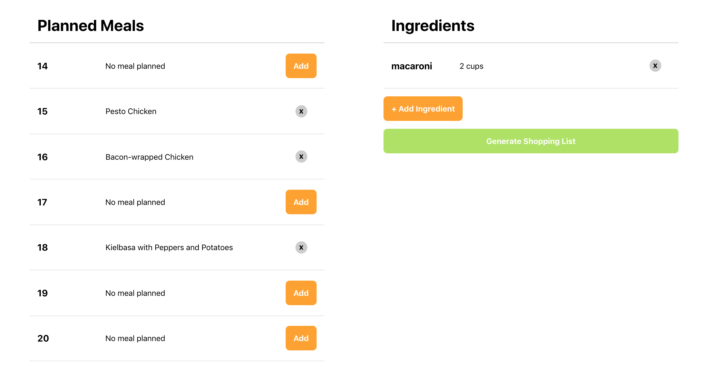

#  Meal Tracker : React, Node.js, Express, MongoDB
### This repository has been made while learning @ Shaun Wassell, O'Reilly

## Screenshot


## back-end-template
```bash
npm i
```
```bash
mongod
```
```bash
npm start
```

## front-end-template

```bash
npm i
```
```bash
npm start
```